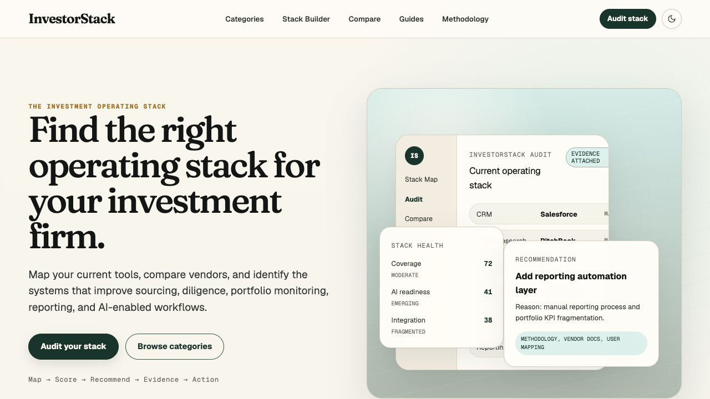
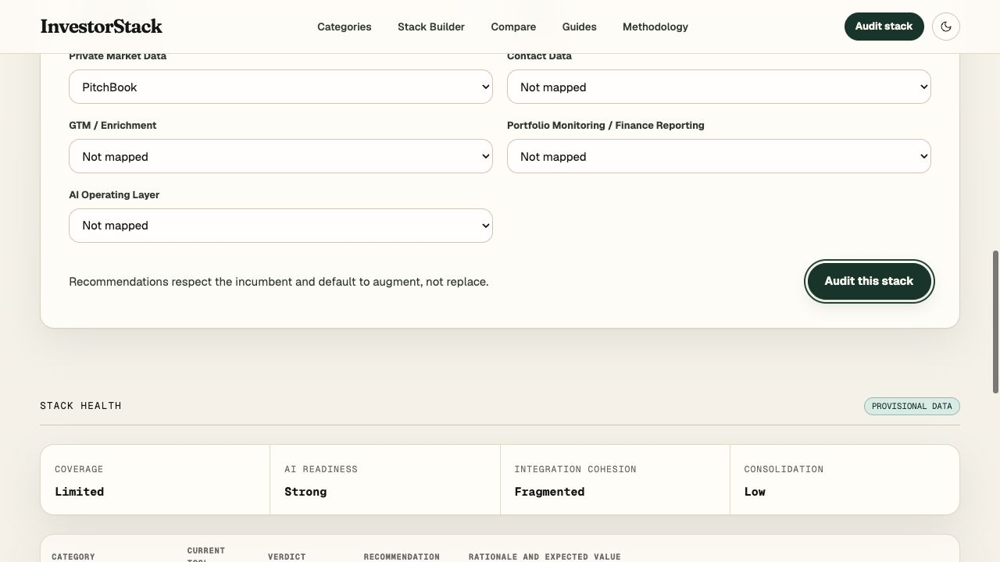
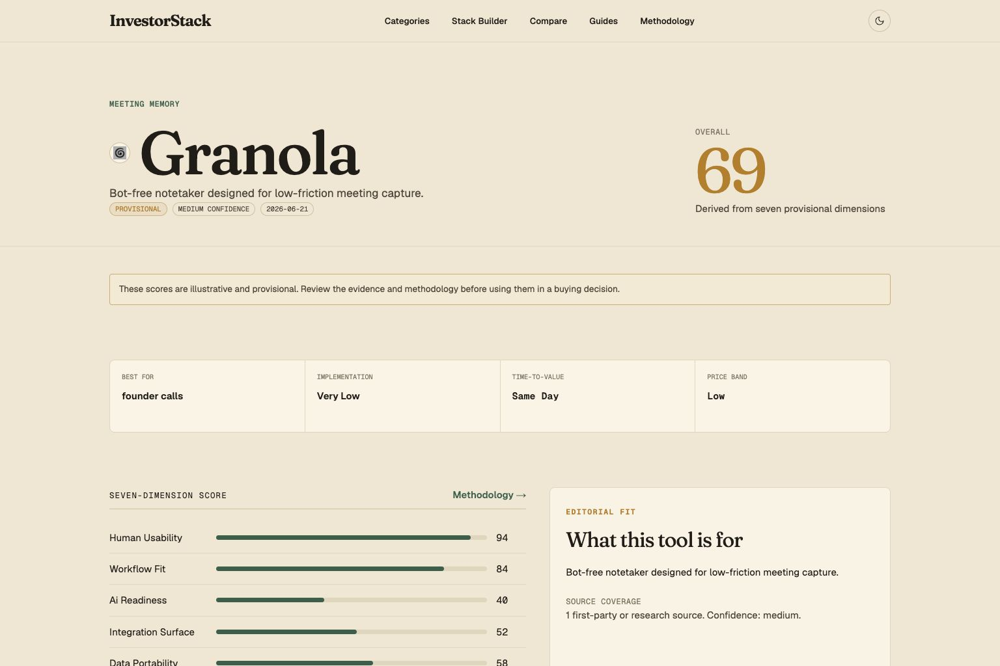
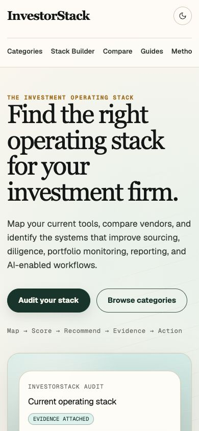
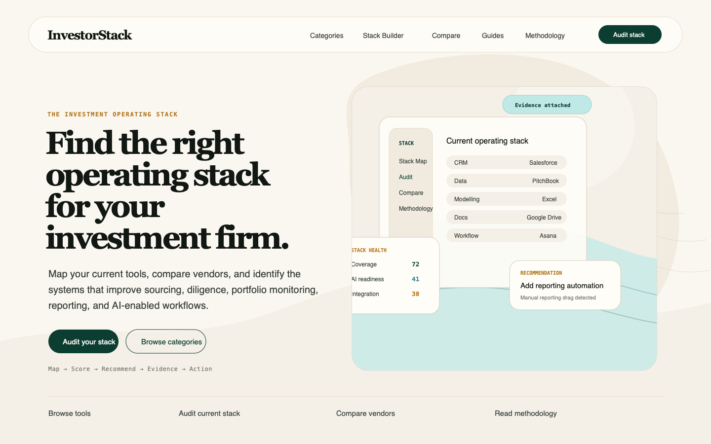
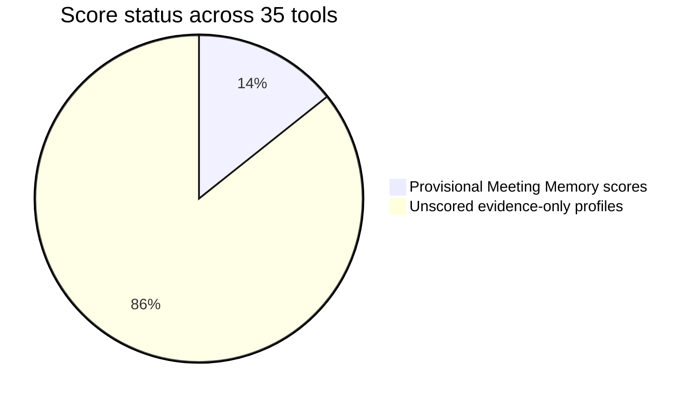
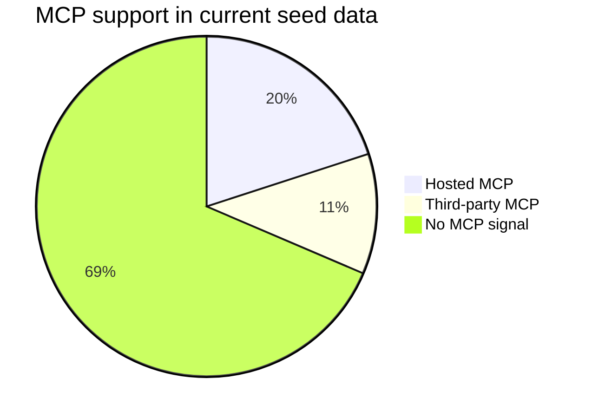
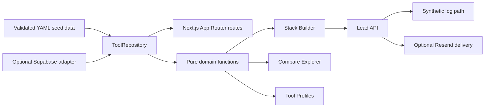

# InvestorStack

> A practical operating-stack map for investment firms: browse the tool universe, audit the current stack, compare vendors, and turn evidence into a recommended next move.

[](https://investorstack.vercel.app)
[](https://nextjs.org)
[](https://react.dev)
[](#data-trust)
[](#environment)

<p align="center">
  <a href="https://investorstack.vercel.app">
    
  </a>
</p>

InvestorStack is a small, evidence-led product for private-market teams trying to answer a very common question:

> Which tools should this firm keep, add, replace, or ignore?

It starts with the real operating jobs inside an investment firm: sourcing, enrichment, outreach, meeting capture, relationship management, diligence, portfolio monitoring, reporting, and AI-enabled knowledge work. It then maps tools to those jobs and makes the recommendation logic visible.

The important distinction: InvestorStack is not just a software directory. The directory is the evidence layer. The main product moment is the stack audit and recommendation flow.

## Live Surface

| Surface | Purpose |
|---|---|
| [Home](https://investorstack.vercel.app) | Product overview and workflow entry points |
| [Stack Builder](https://investorstack.vercel.app/stack-builder) | Current-stack audit and recommendation engine |
| [Categories](https://investorstack.vercel.app/categories) | Workflow-led software universe |
| [Compare](https://investorstack.vercel.app/compare) | Side-by-side vendor comparison |
| [Guides](https://investorstack.vercel.app/guides) | Short operating-stack playbooks |
| [Methodology](https://investorstack.vercel.app/methodology) | Evidence, scoring, confidence, and trust rules |

## Product Screens

<table>
  <tr>
    <td width="50%">
      
      <br>
      <strong>Stack audit</strong>
      <br>
      Map incumbents, identify gaps, and produce keep, add, replace, or fill-gap verdicts.
    </td>
    <td width="50%">
      
      <br>
      <strong>Tool profile</strong>
      <br>
      Show fit, provisional scores where available, source coverage, and AI-readiness signals.
    </td>
  </tr>
  <tr>
    <td width="50%">
      
      <br>
      <strong>Mobile homepage</strong>
      <br>
      The same workflow-first product story on a narrow viewport.
    </td>
    <td width="50%">
      
      <br>
      <strong>Design direction</strong>
      <br>
      Calm, evidence-backed, warm institutional software rather than generic SaaS gloss.
    </td>
  </tr>
</table>

## What It Does

| Capability | What it means in the product |
|---|---|
| Workflow-led directory | Seven operating categories, each mapped to investment-firm jobs rather than generic software labels. |
| Stack Builder | Captures firm profile, current tools, primary workflows, technical maturity, budget posture, and implementation ownership. |
| Incumbent-aware audit | Recommends when to keep, add alongside, consider replacing, or fill a missing capability. |
| Comparison explorer | Compares two to four tools against fit, implementation burden, time-to-value, AI readiness, and evidence. |
| Tool profiles | Shows best-for, not-best-for, category, source coverage, review date, confidence, and AI interface signals. |
| Methodology page | Makes weights, confidence labels, score status, commercial separation, and limits visible. |
| Lead capture seam | Validated route for advisory interest, with synthetic logging until Resend is configured. |

## Tool Universe

The current seed universe covers **35 tools**, across **seven categories**, with **five tools per category**.

| Category | Tools |
|---|---|
| Meeting Memory | Fathom, Fireflies, Avoma, Granola, Otter |
| CRM / Relationship Intelligence | Affinity, DealCloud, Salesforce, HubSpot, Attio |
| Private Market Data | PitchBook, Grata, Sourcescrub, Inven, Dealroom |
| Contact Data | Cognism, Apollo, ZoomInfo, RocketReach, Lusha |
| GTM / Enrichment | Clay, Persana, folk, Unify, FullEnrich |
| Portfolio Monitoring / Finance Reporting | Chronograph, 73 Strings, Allvue, Visible, Abacum |
| AI Operating Layer | Claude, ChatGPT and Codex, Gemini, Perplexity, Hebbia |

The workflow map currently spans **nine stages**:

```text
Source -> Enrich -> Score -> Outreach -> Meet -> Manage -> Diligence -> Monitor -> Report
```

## Recommendation Flow

InvestorStack keeps the logic deliberately boring and inspectable. No LLM call is needed to produce the pass-1 recommendation.

```text
Firm profile
  |
  |-- firm type
  |-- team size
  |-- workflows
  |-- technical maturity
  |-- budget posture
  |-- implementation owner
  v
Relevant workflow categories
  v
Candidate tools per category
  v
Profile-weighted scoring and incumbent mapping
  v
Stack audit verdicts
  |
  |-- keep
  |-- add_alongside
  |-- consider_replacing
  |-- fill_gap
  v
Implementation sequence, rationale, and expected value
```

Core behaviour:

- Establish the system of record first where the selected workflows require it.
- Prefer "add alongside" over rip-and-replace when the current tool is defensible.
- Penalise heavy implementation burden when no owner is available.
- Penalise enterprise-price tooling when the profile is budget-sensitive.
- Weight human usability more heavily for spreadsheet-native teams.
- Weight AI readiness, integration surface, and data portability more heavily for API-ready and AI-enabled teams.

## Scoring Model

Only the Meeting Memory category carries provisional numeric scores in this version. The rest of the universe is explicitly unscored until the evidence pass is strong enough.

| Dimension | Weight |
|---|---:|
| Human usability | 20 |
| Workflow fit | 20 |
| AI readiness | 20 |
| Integration surface | 15 |
| Data portability | 10 |
| ROI potential | 10 |
| Vendor maturity | 5 |



## Data Trust

InvestorStack is opinionated about trust:

- Paid activity must never create, order, or change a rank, score, or verdict.
- Provisional data is labelled in the UI.
- Every tool has source URLs and a `last_reviewed_at` date.
- Scores are separated from qualitative fit notes.
- Seed data and Supabase data pass through the same Zod contracts.
- Synthetic lead handling is explicit until production credentials are supplied.

Current evidence coverage:

| Signal | Current coverage |
|---|---:|
| Tools in seed universe | 35 |
| Categories | 7 |
| Workflow stages | 9 |
| Guides | 3 |
| Documented public API | 32 tools |
| Hosted MCP support | 7 tools |
| Third-party MCP support | 4 tools |
| Robust webhook signal | 18 tools |
| Structured export or sync signal | 33 tools |



## Architecture

```text
src/app/*
  |
  v
getRepository()
  |
  |-- SeedRepository
  |     |
  |     v
  |   data/categories.yaml
  |   data/tools.yaml
  |   data/workflows.yaml
  |   data/guides.yaml
  |
  |-- SupabaseRepository
        |
        v
      Supabase tables and RLS policies

Both paths
  |
  v
Zod schemas
  |
  v
Pure domain logic
  |
  |-- scoring.ts
  |-- recommendations.ts
  |-- stack-audit.ts
  v
Server-rendered routes plus small client islands
```



## Stack

| Layer | Choice |
|---|---|
| Framework | Next.js 16 App Router |
| UI runtime | React 19 |
| Language | TypeScript |
| Styling | Tailwind CSS 4 and project tokens |
| Data contracts | Zod 4 |
| Default data | Validated YAML seed files |
| Optional database | Supabase, with RLS and seed script |
| Optional email | Resend |
| Tests | Vitest, Testing Library, jsdom |
| Deployment | Vercel |

## Repository Map

```text
.
|-- data/                         Seed categories, tools, workflows, and guides
|-- docs/
|   |-- backend.md                Supabase and email activation notes
|   |-- decisions.md              Architecture decisions
|   |-- verification.md           Test, build, route, browser, and Lighthouse evidence
|   |-- concepts/                 Design concepts and source visuals
|   `-- verification/             Production screenshots and Lighthouse reports
|-- public/
|   |-- images/                   Site imagery
|   `-- logos/                    Tool marks
|-- scripts/                      Data validation, copy linting, seeding, logo fetch
|-- src/
|   |-- app/                      App Router pages, metadata, sitemap, APIs
|   |-- components/               Directory, compare, stack, nav, lead, and common UI
|   |-- lib/domain/               Scoring, recommendation, audit, and schemas
|   |-- lib/repository/           Seed and Supabase repositories
|   `-- styles/                   Token layer
|-- supabase/                     Migration, config, and seed SQL
`-- tests/                        Unit and component coverage
```

## Run Locally

Requires Node 24.

```bash
npm install
```

```bash
cp .env.example .env.local
```

```bash
npm run dev
```

Open `http://localhost:3000`.

Seed mode requires no external services.

## Verify

```bash
npm run check
```

```bash
npm run build
```

`npm run check` runs the full low-noise gate:

```text
validate:data -> lint:copy -> lint -> typecheck -> test
```

Useful individual commands:

| Command | Purpose |
|---|---|
| `npm run validate:data` | Parse YAML and enforce the Zod data contracts |
| `npm run lint:copy` | Catch external-copy issues, including em dash usage |
| `npm run lint` | ESLint with zero warnings |
| `npm run typecheck` | TypeScript without incremental cache |
| `npm test` | Vitest suite |
| `npm run build` | Production Next.js build |
| `npm run seed:supabase` | Copy validated seed data into Supabase |
| `npm run fetch:logos` | Refresh tool marks |

## Latest Verification Snapshot

Recorded in [`docs/verification.md`](docs/verification.md):

| Check | Result |
|---|---|
| `npm run check` | Passed |
| `npm run build` | Passed, 59 routes generated |
| `npm audit --audit-level=high` | No high-severity findings |
| Production route checks | `/`, `/stack-builder`, `/compare`, `/methodology`, `/categories/meeting-memory`, `/sitemap.xml` returned 200 |
| Production error logs | No logs found for the final deployment window |
| Browser QA | Desktop, mobile 390 by 844, stack audit interaction, and console checks passed |
| Lighthouse home | Performance 95, accessibility 100 |
| Lighthouse tool page | Performance 95, accessibility 100 |

Retained artefacts:

- [`docs/verification/lighthouse-home-final6.json`](docs/verification/lighthouse-home-final6.json)
- [`docs/verification/lighthouse-tool-final.json`](docs/verification/lighthouse-tool-final.json)
- [`docs/verification/institutional-pastoral-home-production-desktop.png`](docs/verification/institutional-pastoral-home-production-desktop.png)
- [`docs/verification/institutional-pastoral-home-production-mobile.png`](docs/verification/institutional-pastoral-home-production-mobile.png)
- [`docs/verification/institutional-pastoral-stack-audit-production.png`](docs/verification/institutional-pastoral-stack-audit-production.png)

## Environment

| Variable | Required | Purpose |
|---|---:|---|
| `NEXT_PUBLIC_SITE_URL` | Production | Canonical metadata and sitemap URL |
| `USE_SUPABASE` | No | Select hosted data instead of validated YAML |
| `NEXT_PUBLIC_SUPABASE_URL` | Supabase only | Hosted project URL |
| `SUPABASE_SECRET_KEY` | Supabase only | Server-only repository and seed access |
| `RESEND_API_KEY` | Email only | Lead notification delivery |
| `RESEND_FROM_EMAIL` | Email only | Verified sender |
| `LEAD_NOTIFICATION_EMAIL` | Email only | Internal destination |

Default production mode is credential-free:

```text
USE_SUPABASE=false
RESEND_API_KEY unset
```

That path renders the full product from validated seed data and records synthetic lead activity without sending email.

## Supabase Activation

The repository is ready for hosted data, but does not require it for a working deployment.

```bash
supabase db push
```

```bash
npm run seed:supabase
```

Then set:

```bash
USE_SUPABASE=true
```

The adapter validates database payloads with the same schemas as seed mode, so shape drift fails loudly.

## Commercial And Editorial Rules

InvestorStack is allowed to become a lead-generation and advisory product. It is not allowed to become pay-to-rank.

| Rule | Practical meaning |
|---|---|
| Editorial rank stays separate | Paid profiles, sponsorship, introductions, or advisory work cannot change rank or verdict. |
| Evidence stays visible | Every scored view should expose source coverage, confidence, and review date. |
| Synthetic data is labelled | Pass-1 recommendations and provisional Meeting Memory scores are visible as provisional. |
| Incumbents get respect | The audit should recommend keeping or adding alongside when replacement evidence is weak. |
| LLM calls are not default | Deterministic checks and structured data come first. |

## Roadmap

Near-term:

- Complete the evidence and scoring pass beyond the provisional Meeting Memory category.
- Provision Supabase, apply the migration, seed it, and enable hosted mode after security-advisor review.
- Configure Resend with a verified sender and internal lead destination.
- Replace process-local rate limiting before real marketing traffic.
- Review vendor marks and product copy before public promotion.
- Add analytics and a custom domain if the project moves beyond portfolio use.

Product decisions to settle:

- Whether to split AI Operating Layer into frontier models and investment research platforms.
- Whether to split Portfolio Monitoring into GP/LP monitoring and portfolio-company FP&A.
- How deep the advisory funnel should be at launch.
- Whether the hero proof should remain CSS-native or become an MP4/WebM product loop.

## Design Direction

The interface follows the Institutional Pastoral Intelligence direction:

- Calm, research-grade, editorial surfaces.
- Parchment and ivory base with forest, teal, and ochre accents.
- Serif authority for product story, clean sans UI for operational work.
- Visible evidence, confidence, and review metadata.
- Product proof over decorative motion.

The goal is simple: feel like a trustworthy operating tool for serious investment work, not a glossy software catalogue.

## Status

InvestorStack is live in seed mode at [investorstack.vercel.app](https://investorstack.vercel.app). The current version is suitable as a portfolio-grade public surface and as a working base for the next data, scoring, Supabase, Resend, and advisory-funnel pass.
